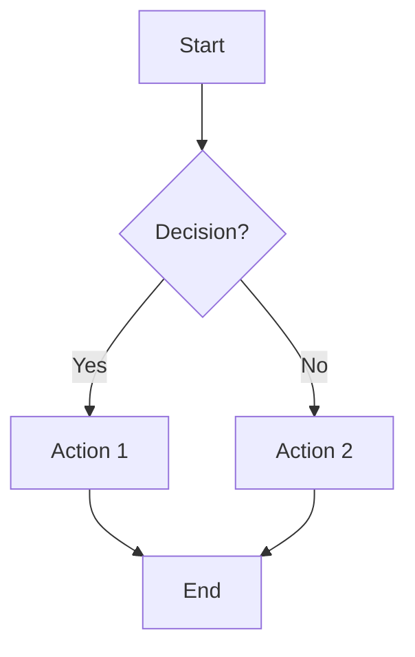
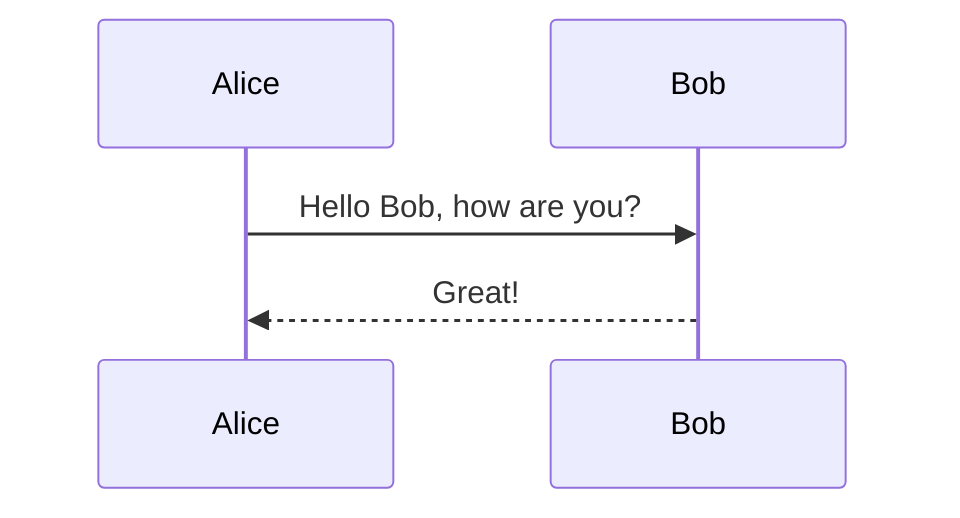
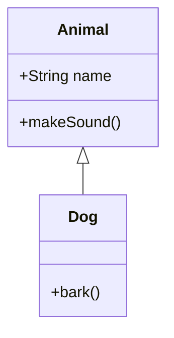

# YouGems Documentation

## Chapter 1: Introduction

### 1.1 Introduction
YouGems is a powerful documentation and diagramming library designed to help developers create interactive and visually appealing documentation. It supports various diagram types, including flowcharts, sequence diagrams, and class diagrams, making it easy to visualize complex concepts.

### 1.2 Key Features
- Responsive design with mobile-first approach
- Dark/Light theme switching
- Client-side search functionality
- Auto-generated table of contents
- Collapsible sidebar navigation
- Performance optimizations

### 1.3 About YouGems
YouGems is a comprehensive documentation and diagramming solution that provides powerful tools for creating interactive documentation, flowcharts, sequence diagrams, and more.

#### What is YouGems?
YouGems combines the power of markdown documentation with advanced diagramming capabilities, making it easy to create professional documentation that includes visual elements.

## Chapter 2: Getting Started

### 2.1 Installation
Get started by following these simple installation steps:

Shows users how to implement YouGems immediately after installation.

Structure:
- Section container with quick-start heading and anchor ID
- Action-oriented introduction promising rapid setup
- Code block featuring JavaScript language indicator
- More complex copy button with escaped newlines (\n)
- Multi-line code example showing import, configuration, and initialization

How They Work Together:
These sections create a linear workflow:
- Install the package (Installation section)
- Implement basic usage (Quick Start section)

Key Features:
Interactive Elements:
- Copy buttons with data-copy attributes for one-click copying
- Proper syntax highlighting preparation with language indicators

User Experience:
- Minimal friction from installation to working code
- Clear visual separation between terminal commands and JavaScript code
- Progressive complexity (simple install → basic implementation)

```bash
npm install my-docs-library
```

### 2.2 Quick Start
Here's how to get up and running quickly:

```javascript
import MyLibrary from 'my-docs-library';

const instance = new MyLibrary({
  theme: 'dark',
  responsive: true
});

instance.init();
```

## Chapter 3: Diagram Syntax

### 3.1 Flowchart
Create beautiful flowcharts using simple syntax:



### 3.2 Sequence Diagram
Document interactions between different components:



### 3.3 Class Diagram
Model your application's structure with class diagrams:



### 3.4 Packet
Model your application's structure with Packet.

### 3.5 Other Examples
Model your application's structure with Other Examples.

## Chapter 4: Configuration

### 4.1 Basic Configuration
Configure YouGems with these basic options:

```json
{
  "theme": "light",
  "responsive": true
}
```

### 4.2 Advanced Settings
For more complex use cases, explore these advanced configuration options:

#### Configuration Options
Available configuration parameters and their usage:
- `theme` - Set the visual theme (light/dark)
- `responsive` - Enable responsive behavior
- `autoResize` - Automatically resize diagrams
- `showGrid` - Display background grid

### 4.3 Themes
Customize the appearance with built-in themes or create your own:

#### Available Themes
- Light Theme
- Dark Theme
- High Contrast
- Custom Themes

## Chapter 5: API Reference

### 5.1 API Methods
Complete reference of all available methods in the API:

#### Core Methods
- `init()` - Initialize the YouGems instance
- `render()` - Render diagrams
- `destroy()` - Clean up resources
- `setTheme(theme)` - Change theme dynamically

### 5.2 Events
Event system documentation and usage examples:

#### Available Events
- `ready` - Fired when YouGems is initialized
- `render` - Fired when a diagram is rendered
- `error` - Fired when an error occurs
- `themeChange` - Fired when theme changes

### 5.3 Properties
All configurable properties and their default values:

| Property | Type | Default | Description |
|----------|------|---------|-------------|
| theme | string | 'light' | Visual theme |
| responsive | boolean | true | Enable responsive behavior |

### 5.4 API Usage
Understand how to use the YouGems API effectively:

#### Making API Calls
Learn how to make API calls to YouGems:

```javascript
fetch('https://api.yougems.com/v1/docs')
  .then(response => response.json())
  .then(data => console.log(data));
```

### 5.5 YouGems API Configuration
Configure the YouGems API settings:

#### API Key
Obtain your API key from the YouGems dashboard and set it in your configuration:

```json
{
  "apiKey": "YOUR_API_KEY"
}
```

### 5.6 YouGems Configuration Options
Explore the available configuration options for YouGems:

#### Common Options
- `theme` - Set the visual theme (light/dark)
- `responsive` - Enable responsive behavior

## Chapter 6: Ecosystem

### 6.1 YouGems Chart
Integrate YouGems with popular charting libraries:

#### Supported Libraries
- Chart.js
- Highcharts
- Google Charts

### 6.2 Tutorials
Step-by-step guides to help you get the most out of YouGems:

#### Beginner Tutorials
- Introduction to YouGems
- Creating Your First Diagram

#### Advanced Tutorials
- Using YouGems with React
- Using YouGems with Vue

## Chapter 7: FAQ

### 7.1 Frequently Asked Questions
Frequently asked questions about YouGems:

#### General Questions
- What is YouGems?
- How to install YouGems?

## Chapter 8: Contributing

### 8.1 Contributing to YouGems
Learn how to contribute to the YouGems project:

#### Getting Started with contributing to YouGems
Follow these steps to get started with contributing:

```bash
git clone https://github.com/your-repo/yougems.git
cd yougems
npm install
```

### 8.2 Adding Diagrams
Contribute your diagrams to the YouGems project:

#### Diagram Guidelines
Follow these guidelines when creating diagrams:
- Use clear and descriptive labels
- Keep diagrams simple and focused
- Ensure diagrams are responsive

### 8.3 Questions and Suggestions
We welcome your questions and suggestions:

#### Contact Us
Reach out to us via the following channels:
- Email: support@yougems.com
- Twitter: @yougems

### 8.4 Security
Your security is important to us:

#### Reporting Vulnerabilities
If you discover a security vulnerability, please report it:

```markdown
**Security Vulnerability Report**

**Description:** [Provide a brief description of the vulnerability]

**Steps to Reproduce:** [Detail the steps to reproduce the vulnerability]

**Impact:** [Explain the potential impact of the vulnerability]

**Mitigation:** [Suggest mitigations or fixes]

**Reporter Information:** [Optional: Your name and contact information]
```

## Chapter 9: Latest News

### 9.1 Announcements
Stay updated with the latest announcements:

#### Version 2.0 Released
We are excited to announce the release of YouGems version 2.0. This major update includes:
- New diagram types: Gantt charts, Pie charts
- Enhanced API with new endpoints
- Improved performance and stability

### 9.2 Blog
Read the latest blog posts:

#### Introducing YouGems 2.0
Discover the new features and improvements in YouGems 2.0.

## Appendix: Image Gallery

### Gallery Items
1. A stylized background inspired by the Netflix series "Shadow and Bone," featuring abstract bone and shadow shapes for a dramatic effect.
2. The Firefox web browser logo, representing open-source technology, privacy, and internet freedom.
3. The OpenAI logo, symbolizing artificial intelligence, machine learning, and innovative technology.
4. An illustration of a lizard, adding a playful and natural element to the design.